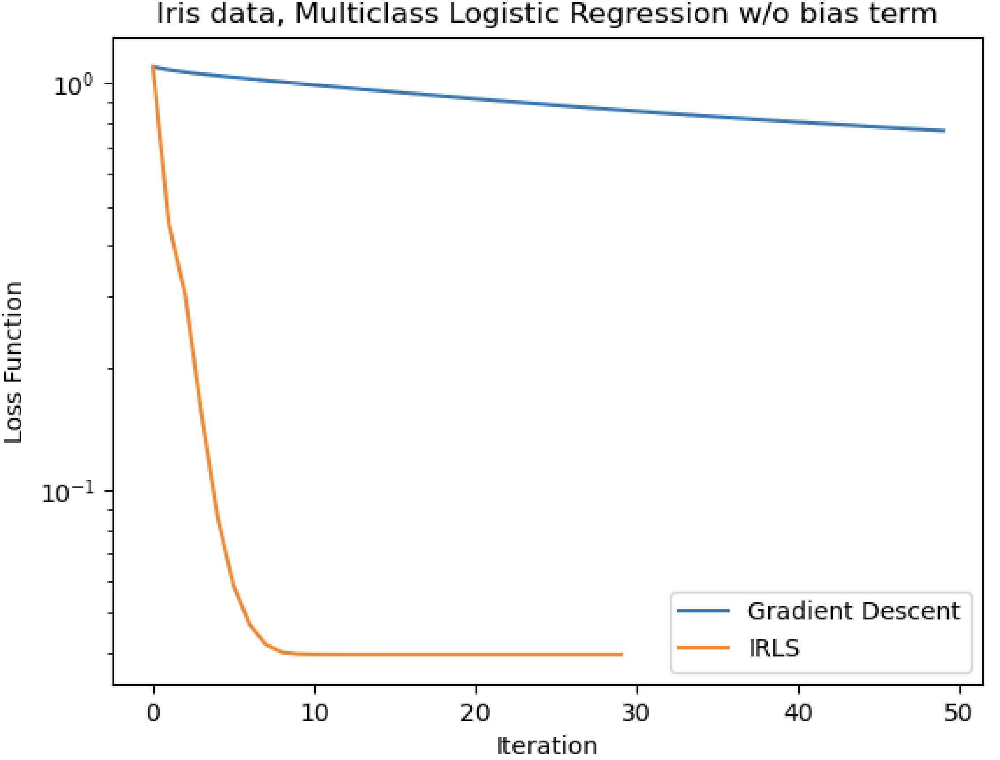
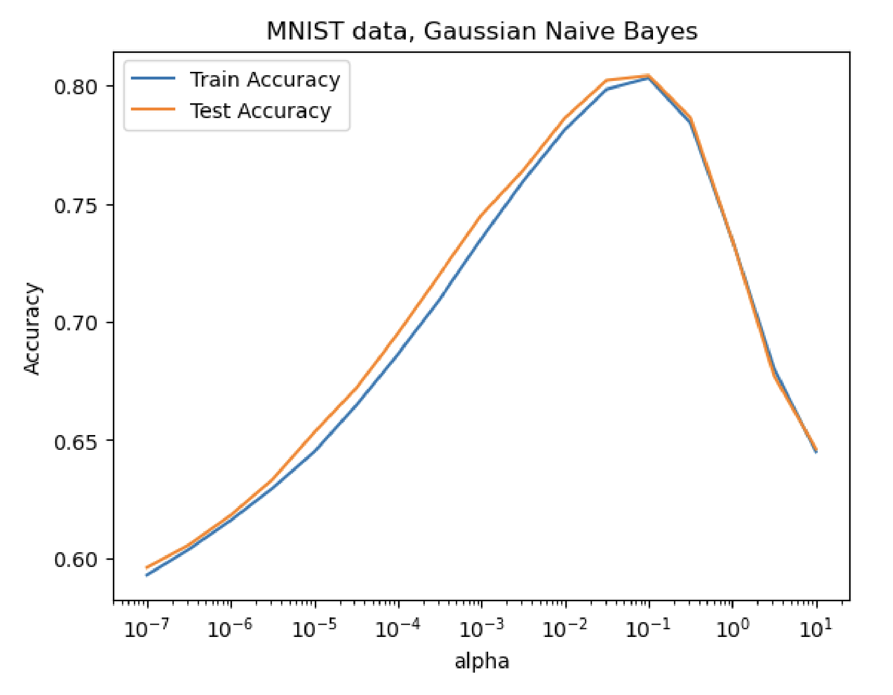
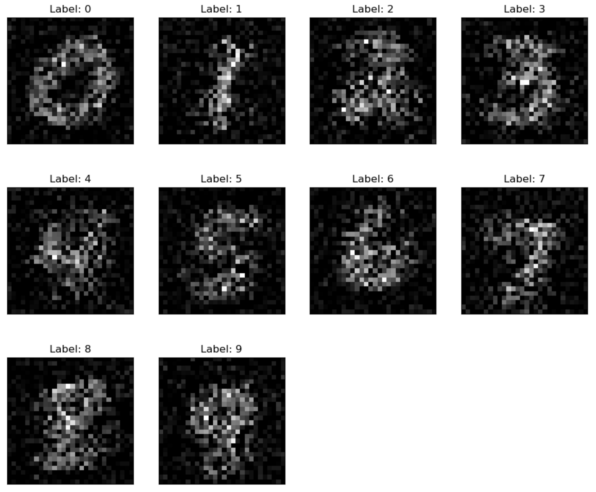

# ML Classifiers: Logistic Regression (GD/IRLS) + Naive Bayes (Gaussian/Bernoulli)

A machine-learning project implementing:

- **Multiclass (softmax) logistic regression** trained with **gradient descent**
- **Multiclass logistic regression (K−1 parameterization)** trained with **Newton / IRLS**
- **Gaussian Naive Bayes** (with variance smoothing) + **sampling**
- **Bernoulli Naive Bayes** (with Lidstone smoothing) + **sampling**

Benchmarked on:
- **Iris** (toy multiclass dataset)
- **MNIST (OpenML)** (handwritten digits)

---

## Setup

### 1) Create an environment (recommended)

```bash
python -m venv .venv
source .venv/bin/activate
```

### 2) Install dependencies

```bash
pip install -r requirements.txt
```

Optional dev dependencies (tests):

```bash
pip install -r requirements-dev.txt
```

---

## Running experiments

All scripts are designed to run from the **repo root**.

### Iris

Gradient Descent (no bias):
```bash
python scripts/iris_gd.py
```

Gradient Descent (with bias via intercept feature):
```bash
python scripts/iris_gd_bias.py
```

IRLS/Newton vs GD (no bias):
```bash
python scripts/iris_irls_vs_gd.py
```

IRLS/Newton vs GD (with bias via intercept feature):
```bash
python scripts/iris_irls_vs_gd_bias.py
```

Scikit-learn baseline comparisons:
```bash
python scripts/iris_sklearn_baseline.py
```

### MNIST (OpenML)

Gaussian NB baseline (alpha=1e-7):
```bash
python scripts/mnist_gnb_baseline.py
```

Gaussian NB smoothing sweep:
```bash
python scripts/mnist_gnb_sweep.py
```

Gaussian NB digit generation (uses `alpha_best=0.1` by default):
```bash
python scripts/mnist_gnb_generate.py
```

Bernoulli NB eval (alpha=1e-8):
```bash
python scripts/mnist_bnb_eval.py
```

Bernoulli NB digit generation:
```bash
python scripts/mnist_bnb_generate.py
```

**Note on MNIST download:** `fetch_openml` caches downloads under `openml_cache/` (ignored by git). The first MNIST run can take a while depending on network speed.

---

## Outputs (figures)

Scripts write figures into `outputs/figures/`. The README embeds these using relative paths, so commit the generated images.

### Iris: IRLS/Newton vs Gradient Descent (no bias)


### MNIST: Gaussian Naive Bayes smoothing sweep


### MNIST: Generated digits (Gaussian NB)


### MNIST: Generated digits (Bernoulli NB)


---

## Notes on numerical stability

- Logistic regression loss uses `scipy.special.log_softmax` to avoid overflow/underflow.
- Naive Bayes prediction is computed in **log-space** and normalized with `scipy.special.logsumexp`.
- Gaussian NB variance smoothing improves stability on high-dimensional MNIST features.

---

## Tests (optional)

Run sanity checks:

```bash
pytest -q
```

---

## License

MIT (see `LICENSE`).
